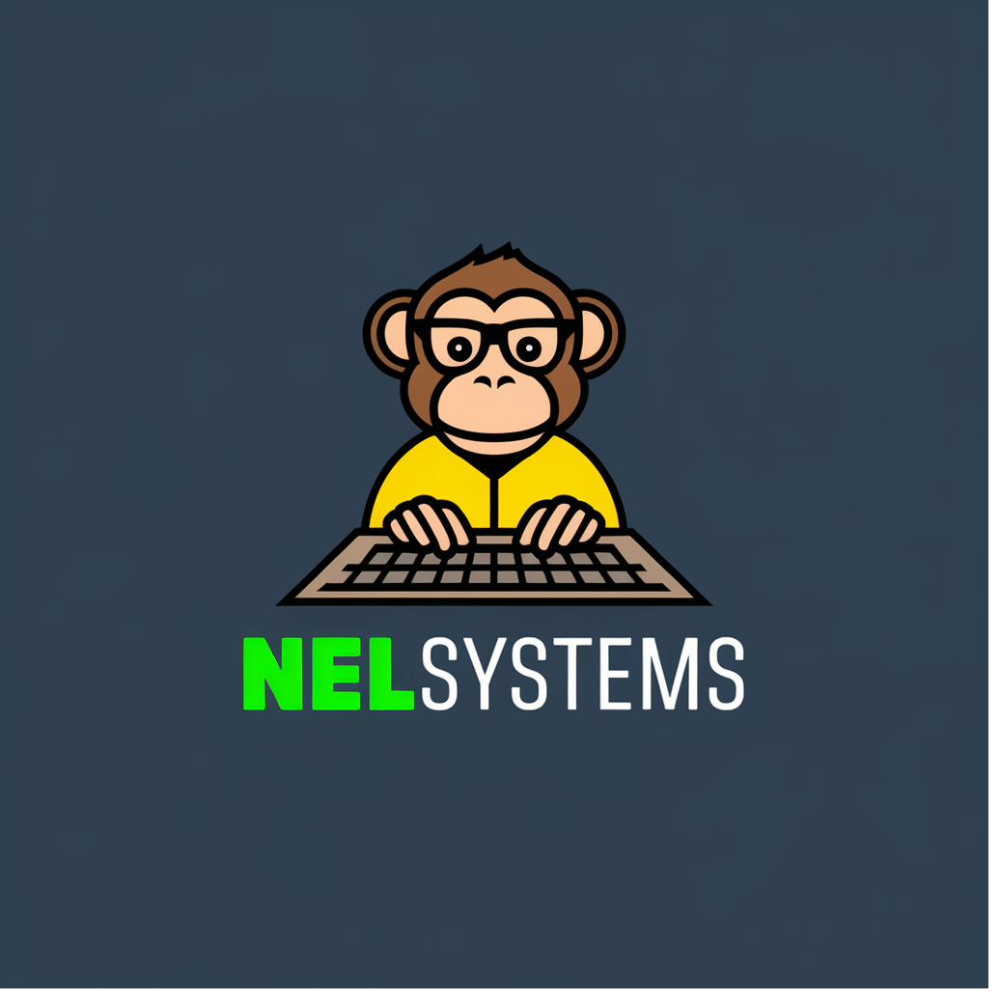

# Mi Economía by NelSystems



## 📱 Aplicación Web Progresiva (PWA) de Control Financiero

**Mi Economía** es una solución completa y moderna para gestionar tus finanzas personales de forma integral, clara y automatizada. Funciona 100% offline y es compatible con Android, iOS y Windows.

---

## ✨ Características Principales

### 📊 Dashboard Financiero
- Resumen visual de ingresos, gastos y balance
- Gráficos interactivos de distribución y flujo de caja
- Alertas automáticas de obligaciones próximas a vencer
- Indicadores clave (KPIs) de ahorro y salud financiera

### 💰 Gestión de Ingresos
- Registro de ingresos fijos y variables
- Categorización automática (salario, bonos, freelance, inversiones)
- Soporte para ingresos recurrentes
- Historial completo con filtros

### 💸 Gastos Variables
- Control de gastos ocasionales (gasolina, mantenimiento, salud, etc.)
- 8 categorías predefinidas
- Análisis de patrones de gasto
- Integración automática con compras de supermercado

### 📅 Obligaciones Recurrentes
- Gestión de pagos fijos (electricidad, agua, internet, seguros, suscripciones)
- Sistema de alertas configurables por días de anticipación
- Detección automática de pagos vencidos
- Historial de pagos realizados

### 🛒 Módulo de Supermercado
- Creación de listas de compras
- Categorización de productos
- Estimación de costos
- **Integración automática**: al finalizar una compra, se registra como gasto en la categoría "Supermercado"

### 🧮 Calculadoras Financieras
1. **Préstamos**: Calcula cuotas mensuales y total de intereses
2. **Ahorro**: Proyecta el valor futuro de tus ahorros
3. **Inversión**: Simula rendimientos con aportes periódicos
4. **Salida de Deudas**: Determina el tiempo necesario para liquidar deudas

### 📈 Reportes y Análisis
- Reportes por período (mes, trimestre, semestre, año)
- Gráficos de tendencias históricas
- Análisis por categorías
- Exportación de datos

---

## 🚀 Instalación y Despliegue

### Opción 1: GitHub Pages

1. Sube el proyecto a tu repositorio de GitHub
2. Ve a **Settings** → **Pages**
3. Selecciona la rama `main` y carpeta `/ (root)`
4. Guarda y espera unos minutos
5. Accede a: `https://tu-usuario.github.io/mi-economia-pwa`

### Opción 2: Vercel

```bash
# Instalar Vercel CLI
npm install -g vercel

# Desplegar
cd mi-economia-pwa
vercel
```

### Opción 3: Netlify

```bash
# Instalar Netlify CLI
npm install -g netlify-cli

# Desplegar
cd mi-economia-pwa
netlify deploy --prod
```

### Opción 4: Local

Simplemente abre `index.html` en tu navegador. Para desarrollo, usa un servidor local:

```bash
# Con Python
python -m http.server 8000

# Con Node.js
npx http-server
```

---

## 📱 Instalación como PWA

### Android
1. Abre la app en Chrome
2. Toca el menú (⋮) → **Agregar a pantalla de inicio**
3. Confirma y tendrás un acceso directo

### iOS
1. Abre la app en Safari
2. Toca el botón de compartir 
3. Selecciona **Agregar a pantalla de inicio**

### Windows
1. Abre la app en Edge o Chrome
2. Haz clic en el ícono de instalación en la barra de direcciones
3. Confirma la instalación

---

## 🗂️ Estructura del Proyecto

```
mi-economia-pwa/
├── index.html              # Archivo principal
├── manifest.json           # Configuración PWA
├── sw.js                   # Service Worker (offline)
├── css/
│   └── styles.css          # Estilos completos
├── js/
│   ├── app.js              # Controlador principal
│   ├── db.js               # Gestión de IndexedDB
│   └── modules/
│       ├── dashboard.js    # Módulo Dashboard
│       ├── income.js       # Módulo Ingresos
│       ├── expenses.js     # Módulo Gastos
│       ├── obligations.js  # Módulo Obligaciones
│       ├── supermarket.js  # Módulo Supermercado
│       └── calculators.js  # Módulo Calculadoras
├── assets/
│   └── logo.png            # Logo de la aplicación
├── icons/                  # Iconos PWA (generados)
│   ├── icon-72.png
│   ├── icon-96.png
│   ├── icon-128.png
│   ├── icon-144.png
│   ├── icon-152.png
│   ├── icon-192.png
│   ├── icon-384.png
│   └── icon-512.png
└── README.md
```

---

## 💾 Base de Datos

La aplicación utiliza **IndexedDB** para almacenamiento local (100% offline). Los datos permanecen en el dispositivo del usuario y nunca se envían a servidores externos.

### Tablas (Object Stores)
- `income`: Ingresos
- `expenses`: Gastos variables
- `obligations`: Obligaciones recurrentes
- `obligationPayments`: Historial de pagos
- `shoppingLists`: Listas de compras
- `shoppingProducts`: Productos en listas
- `users`: Usuarios (multi-tenant)
- `settings`: Configuración global

---

## 🎨 Paleta de Colores

```css
--primary: #00D976      /* Verde principal */
--secondary: #3B4F5F    /* Azul-gris */
--accent: #FFD93D       /* Amarillo */
--background: #F8FAFB   /* Fondo claro */
--dark: #1A2332         /* Texto oscuro */
--success: #00D976      /* Verde éxito */
--warning: #FFD93D      /* Amarillo advertencia */
--danger: #F56565       /* Rojo peligro */
--info: #4299E1         /* Azul información */
```

---

## 🔧 Tecnologías Utilizadas

- **Frontend**: HTML5, CSS3 (Grid, Flexbox), JavaScript (ES6+)
- **Gráficos**: Chart.js 4.4.0
- **Base de Datos**: IndexedDB
- **PWA**: Service Workers, Web App Manifest
- **Responsive**: Mobile-first design
- **Offline**: 100% funcional sin conexión

---

## 📊 Arquitectura Multi-Tenant

El sistema está diseñado para soportar múltiples usuarios:
- Cada registro incluye un `userId`
- Filtrado automático por usuario activo
- Base para evolución a SaaS

---

## 🔒 Privacidad y Seguridad

- ✅ **100% Offline**: Ningún dato sale del dispositivo
- ✅ **Sin servidores**: No hay backend externo
- ✅ **Sin tracking**: Cero analytics o seguimiento
- ✅ **Local First**: Los datos pertenecen al usuario

---

## 🚀 Roadmap de Desarrollo

### Fase 1 - MVP ✅ (Completado)
- Dashboard con indicadores clave
- CRUD de ingresos y gastos
- Sistema de obligaciones con alertas
- Módulo de supermercado integrado
- Calculadoras financieras
- PWA funcional offline

### Fase 2 - Mejoras (Futuro)
- [ ] Exportación/importación de datos (JSON, CSV)
- [ ] Modo oscuro
- [ ] Múltiples usuarios por dispositivo
- [ ] Recordatorios push nativos
- [ ] Widgets para pantalla de inicio

### Fase 3 - Inteligencia (Futuro)
- [ ] Categorización automática de gastos con IA
- [ ] Predicción de gastos futuros
- [ ] Score financiero personal
- [ ] Recomendaciones inteligentes de ahorro

### Fase 4 - SaaS (Futuro)
- [ ] Backend opcional (Supabase/Firebase)
- [ ] Sincronización multi-dispositivo
- [ ] Compartir finanzas (familias)
- [ ] Planes premium

---

## 🤝 Contribuciones

Este proyecto es de código abierto. Para contribuir:

1. Fork el repositorio
2. Crea una rama: `git checkout -b feature/nueva-funcionalidad`
3. Commit: `git commit -m 'Agregar nueva funcionalidad'`
4. Push: `git push origin feature/nueva-funcionalidad`
5. Abre un Pull Request

---

## 📄 Licencia

MIT License - Copyright (c) 2026 NelSystems

---

## 📞 Soporte

Para reportar bugs o solicitar funcionalidades, abre un issue en GitHub.

---

## 🎯 Diferenciadores Clave

### vs Otras Apps Financieras

✅ **100% Gratuito y sin publicidad**  
✅ **Sin registro ni login requerido**  
✅ **Funciona completamente offline**  
✅ **PWA instalable en cualquier dispositivo**  
✅ **Código abierto y auditable**  
✅ **Sin límite de transacciones**  
✅ **Módulo de supermercado integrado**  
✅ **Calculadoras financieras incluidas**  
✅ **Diseño moderno y responsive**  
✅ **Multi-tenant desde el diseño**

---

**Desarrollado con ❤️ por NelSystems**
